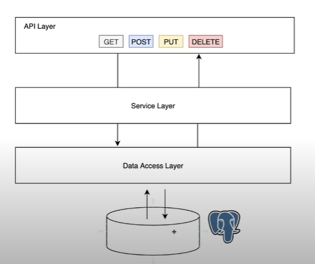
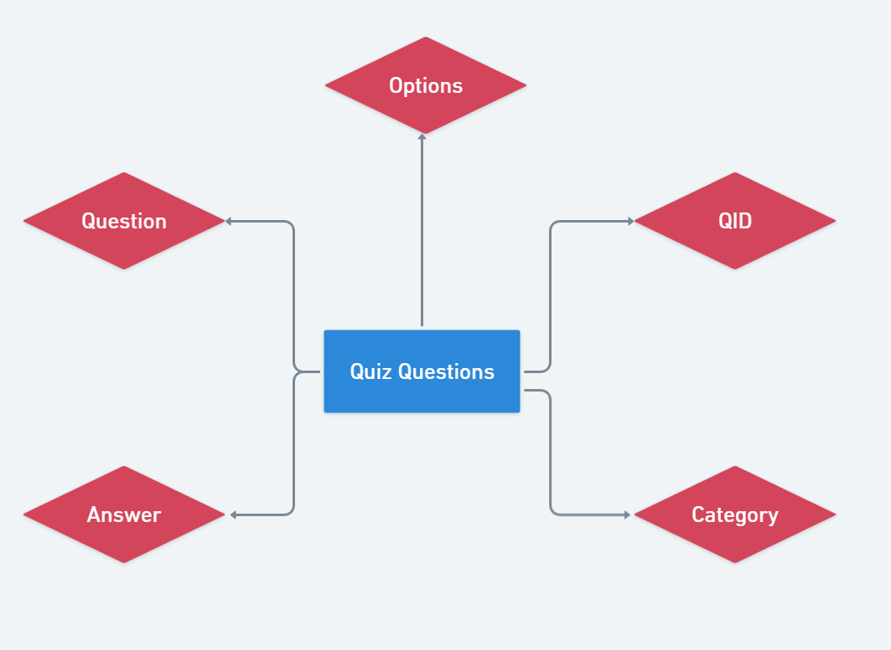
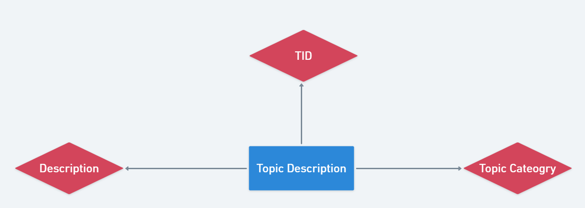

# AlgoWiz Requirements
 
 ## Git Repo
[https://github.com/aadijain725/AlgoWiz](https://github.com/aadijain725/AlgoWiz)

## Team Info & policies

### Roles
Team members are evenly distributed between the three main roles, there is a 
possibility that team members may change roles as features near completion.  

#### UI Designers/Front End Engineers
As a web based application with heavy emphasis on an interactive visual 
component, the UI will be critical to the success of this project. 
Since we have a small team our UI Designers will also act as Front End 
Engineers, responsible for implementing and testing the functionality of the App.

* **Aadi Jain:** Has experience and a keen interest in using React and loves 
developing websites. Further, wants to develop an interactive and user-friendly UI.

* **Shivam Drishti Bhatia:** I have experience in React and always loved how 
the front end works. I also have experience in developing interactive and 
user friendly applications on React. 

* **Estevan Seyfried:** Holds a certificate in, and has worked as a TA for 
UW’s Full Stack Javascript Certificate program. 

#### Back End Engineers 
Responsible for designing and implementing the server and database required 
for the app to function and scale once launched.

* **Wendy Jiang:** I chose backend because I’m interested in creating contents 
for the web page and adding functionality such as the quiz section and visuals 
to the webpage. I’m familiar with Java and am able to create these components.

* **Michael Wen:** I chose backend because I have more experience with 
programming in that area and minimal experience with front end design.

* **Pranesh Reddy Jambula:** Previously worked with frontend technologies 
in other courses, but never worked on backend development before and wanted to 
learn something new.

### Communication Tools
* Source Code Repository - Github 
* Meetings - [Zoom Meeting](https://washington.zoom.us/j/5910630886)
* Discussion platforms:
    * Slack - for higher-level detail discussions and specific interaction with the PM.
    * Discord for more urgent communication and discussions.  
    We split into sub-teams here.
* Keeping track of progress-  Trello (scrum)

### Team Policies
1. Every pull request must have at least two passing reviews before merging 
with the main branch.
2. Bugs must be documented and categorized when they are first encountered. 
3. Major bugs (App crashing) must be resolved before continuing development 
on any related features.
4. At least 2 members per sub team.
5. Whenever possible develop in pairs, one tester, and one coder to have more 
refined code.
6. Front End code should follow Airbnb Style Guide: 
https://github.com/airbnb/javascript/tree/master/react
Front End-- React, Back End -- Java API, possibly Node Express Server 
7. Read the [Git Guide](gitguide.md) for more information regarding 
the AlgoWiz repository policies and best practices.
 
## Product Description

Algowiz is a highly interactive web-based application aimed at spreading the 
love and knowledge we have for computer science. Initially, it will act as 
primarily an academic aid to students and teachers alike. It will cover a wide 
array of topics ranging from sorting and searching algorithms to exploring 
graphs. The experience will include a separate section for each of the 
various topics. Each of these sections will have a study guide, a quiz, and 
a visualizer to help visualize the concepts.

### Major Goals
1. Feature three algorithm topics; Sorting algorithm, Graph algorithm, and 
Searching algorithm.
    * Each topic will feature algorithms. Ex. Sorting algorithm features 
    merge sort, insertion sort. Graph algorithm features pathfinding(Dijkstra’s), 
    Depth First search, Breadth First search. Searching algorithm features binary search.
    * Each algorithm has its own page which will contain introductory material 
    and a list of prerequisite skills. 

2. Quiz system 
    * There will exist an optional quiz section under each algorithm that tests 
    understanding of the particular algorithms. This quiz will act as a 
    stress-free test to the topics learned in the section.  
    * User Interaction:
        * On getting the answers correct, we give some positive feedback 
        (great work) and recommended the next steps
        * On wrong answers, we give some feedback and give hints

3. Interactive visualization of the Algorithms
    * There will be a section with a visualizer which will visualize the 
    internal workings of each algorithm. 
    * The visualizer would have some sort of array/ graphical representation 
    of the algorithm in work.

4. An interactive web-based platform
The app is going to be a web application accessible by anyone using the internet.

### Stretch Goals
1. User Database (Profiles) to keep track of user progress in quizzes and the 
different sections they have covered.
    * We plan on using a Google API to set up a user database system to 
    store and update user progress, 
2. Gamified Point system (reward points) -
    * A reward system to help motivate studying. 
    * Something like a leaderboard to make the experience more rewarding is 
    one possible idea.
    * Further, animations may be added to make the UI experience more fun.
3. Data Structures (to learn basics):
    * We may add a new section on Data structures and some of the more 
    introductory topics. 
    * Topics such as arrays linked lists etc. to cater to an even larger audience. 
 
## Use Cases
(Functional Requirements)

(Wendy)  
> **Actors:** Jane, a sophomore in College, is applying for an internship in the summer.
**Triggers:** Need to refresh on her algorithm concepts so she can ace that interview.
**Preconditions:** Jane browses through AlgoWiz site, there are different 
algorithm concepts under each topic.
**Postconditions:** She has a better understanding of algorithm concepts 
after reviewing and taking the quiz.
>**Steps:**
>1. She clicks on one of the algorithm lessons and it takes her to a new 
page that contains explanations and visuals of that algorithm. She can read 
through each explanation and watch the interactive visualization of that algorithm.
>2. There is an optional quiz section at the end of the algorithm to check 
for understanding.
>3. Jane clicked on the quiz, it takes her to a quiz page, starting with the 
first question.
>4. She receives immediate feedback on her answer. She can click on next to 
move to the next question.
>5. She has the option to exit the quiz and click the back button that will 
take her back to the algorithm page.
> 
> **Extensions:**
> * Jane can continue using the website anytime
> * She can view any algorithms without having to take the quiz
> **Exceptions:**
> * The contents are missing some algorithm concepts

(Estevan) 
>**Actors:** Ben is a college tutor assisting intro to programming students remotely. 
**Triggers:** Ben is looking for a way to help students better understand 
sorting algorithms for an upcoming exam.  
**Preconditions:** Ben is already familiar with AlgoWiz and searches for the 
correct sorting algorithm.  
**Postconditions:** Ben is able to help the student better understand the concept. 
**Steps:** 
>1. Ben searches for and finds the correct algorithm.
>2. He skips the quiz section.
>3. He shares his screen as he use the visualizer to walk the student through 
the algorithm.   
>
>**Extensions:** 
>* Be may choose to have the student use the tool on their own.
>* Ben may use the quiz to help the student in addition to the visualizer.  
>
>**Exceptions:** 
>* The site is down.
>* Ben has trouble navigating the site.

(Michael)  
> **Actors:** Jason is a high school student who learned fundamental 
programming concepts at school.  
**Triggers:** Jason is curious and wants to get an idea of what other, more 
complex programming concepts like algorithms without having to go through 
overly in-depth resources.   
**Preconditions:** Jason is already familiar with programming fundamentals, 
such as loops, methods/functions, syntax. etc.  
**Postconditions:** Jason will get a general idea of what some of the algorithms are. 
**Steps:** 
>1. Jason looks at the algorithm topics that AlgoWiz offers and considers 
which one he is interested in learning
>2. Upon selecting one of the algorithm topics, Jason can click on the lesson 
or take the quiz
>3. Jason clicks on the lesson button and it takes him to a new page that 
covers that algorithm along with a visual and quiz section.
>
>**Extensions:** 
>* Jason can view other algorithms at any time.
>
>**Exceptions:** 
>* AlgoWiz does not provide Jason with a satisfactory summary, which leads him to search elsewhere.
>* Jason is unable to access the lesson, or there is a problem with the
lesson's page.

(Shivam) 
> **Actors:** Elizabeth is a college professor who wants to teach her students 
different graph algorithms and hence uses the app as a teaching tool in her lecture.  
**Triggers:**. Elizabeth wants to give her students a good idea about how
different graph algorithms work and better their understanding of these concepts.
**Preconditions:** These students know computer science fundamentals like 
syntax, loops, methods, and data structures like array, queue, stacks, priority queue.
Postconditions: These students better grasp the idea of these algorithms and 
their working because of the visual demonstrations.  
**Steps** 
>1. Elizabeth explores the AlgoWiz website.
>2. Elizabeth finds the lesson for one of the graph algorithms and
navigates to that lesson page.
>3. Upon selecting the algorithm, Elizabeth views the lesson and gets the 
option to expand the interactive visual element.
>4. By expanding the visual element, she shows students how algorithms work.
>
> **Extensions:** 
>* More high level algorithms can be learned visually.
>* The quiz section of the application can be used to test students .
>
>**Exceptions:** 
>* Website is down.
>* Not all graph algorithms he requires are covered. 
>* The demonstrations sometimes lag.

(Aadi)  
> **Actors:** Arihant is a freshman in College, is preparing for his CSE 14X exam.  
**Triggers:** He needs to learn and also review some algorithm concepts so he 
can do well in his exam.  
**Preconditions:** Arihant browses through the AlgoWiz website using a stable 
internet connection on his computer. He selects a lesson to study.  
**Postconditions:** He has a clearer understanding of the various
algorithms he studied and the quizzes he did.
(And hopefully, he now goes and aces his exam)
**Steps**
>1. He chooses one of the algorithms that he wants to review prior to his exam.
>2. He clicks on that algorithm lesson button and it redirects him to a 
new page with that lesson summary.
>3. In that lesson, he sees interactive visuals which help him more deeply 
understand the underlying concepts.
 >4. He then clicks on the quiz button on the bottom which takes him to a new 
 quiz page. He sees the first question, clicks submit after he picks his answer 
 but got it wrong.
 >5. He gets a few hints on how to approach the problem and some other resource 
 links for further his understanding.
>7. He finishes his lesson and moves back to the course webpage.
>
>**Extensions:** 
>* Arihant was successfully and easily able to navigate through the website.
>* He was able to view and review other algorithms and sections successfully.
>
>**Exceptions:**
>* Some of contents are missing some algorithm concepts and the quiz section 
gives an incorrect output (false positive)
>* He is unable to interact with the visuals.

(Pranesh)
> **Actors:** Jeff is an undergraduate student who is joining as a research 
assistant over the summer.
**Triggers:** He will work under the map routing system team and wants to test 
his knowledge on various graph algorithms before joining.
**Preconditions:** Jeff has already taken a data structures and algorithms 
course last quarter. He only wants to test his knowledge by taking quizzes 
on the algorithms.
**Postconditions:** He is now confident about all the graph algorithms 
listed on AlgoWiz.  
**Steps** 
>1. Jeff explores the AlgoWiz website and goes to the graph algorithms topic.
>2. Jeff then selects the desired algorithm.
>3. Jeff clicked on the quiz button next to the lesson which takes him to 
the quiz directly.
>4. He gets all of the answers right and then moves on to the next algorithm.
>
>**Extensions:** 
>* Jeff may choose to go back to lessons and visualizations to relearn the 
concepts if he gets questions incorrect on the quiz.
>
>**Exceptions:** 
>* AlgoWiz does not have all the graph algorithms that Jeff requires.
>* The questions are not correctly displayed in the quiz.
>* The website is down.
>* He encounters some glitches while selecting the answers in the quiz.

## Non-functional Requirements

### Scalability
* How to handle millions of users? This app is UI heavy instead -- 
lots of users can access the website at once.
* This depends on how server heavy our app is and where we are hosting it.
* We’ll start out with a small backend like NoSQL (Google Firebase) that can 
easily be scaled as required in the future. 

### Security and Privacy
* No user data will be gathered.
* Stretch goals will utilize OAuth to avoid storing passwords.

### Usability
* Targeting people with basic computer science background knowledge 
(will not be explaining basic structures such as for loops, conditionals etc). 
* People who have any experience with some basic CS concepts will easily be 
able to access and utilize our website. 
* Heavy emphasis on user friendly UI. 
* Follow W3C Accessibility Standards wherever possible. 

### Portability and Compatibility
As a React Web App, all popular browsers including Internet Explorer 9 
and above are supported. Older IE versions require some polyfills, 
which we do not plan on implementing at this time. As a Web based 
application anyone with a stable internet connection and modern browser 
will be able to access.
 
## External Requirements
* AlgoWiz is a web based application, therefore the latest version must be 
hosted on a public url. We plan to use Heroku  which will allow us to publish 
the latest version of our app. We plan to implement this service as soon as we 
have a deployable product so that we may begin user testing throughout the 
development process. 
* There are two main components to this application, the REACT Front End and 
Java Spring Boot backend server. Both must include documentation so they can 
be built and deployed by other contributors and reviewers.
* In addition to the REACT documentation to deploy via NPM, a one step 
build system should be implemented to allow local deployment of both the front 
and back end components from the root directory of the repository in one step. 

### Toolset
* Version Control: Git - well documented standard for version control
* REACT Build System: NPM - standard solution for Node Development

### Front End
* React - widely used, well documented, scalable library for front end web development.
* Javascript, CSS - standard web development languages
* Team members are free to develop using whichever code editor they are most familiar.

### Back End 
* Java Spring Boot framework
* Algorithms like sorting and pathfinding will be implemented in the 
backend of our program with Java.

## Schedule:
* Meeting twice each week: Tuesday/Thursday 1:30 pm PST. 
Here we check in and discuss all progress and set goals according to backlogs 
/ current progress.
* Front end team: Separate coding  meets on Saturdays/Sundays/Mondays  
    * Tuesdays:  The entire team will meet up for a quick update. 
    Then each subgroup (frontend and backend) meets separately and discusses 
    their respective team progress and updates the reports.
    * Thursdays: The entire team meets up, discusses progress and goals for 
    next week and finally also reports to the PM.
* Individually meet outside of meetings to collaborate and program alongside 
another member of the same role. 

### Other Important Team Meetings
* Meeting to decide the visualizer, its logic and its visuals to be able to 
get setup done for some rudimentary testing -  05/02 
* Hosting the code onto website 05/10-11 (Beta Release)
* Before the Beta Release (05/11), there will be 2 subgroups that work 
separately on the front and back end of our product. 

### Beta Release Goals
* Front End
    * :white_check_mark: Designing the layouts for homepage, quiz section, 
    and the algorithms section.  - 04/22
    * In progress: Implementing the layouts for homepage, quiz section, 
    and the algorithms section. Currently, developing the various components 
    for each of the pages. 05/04
    * Getting the visualizer setup for at least 1 algorithm and adding 
    the quiz questions from database- 05/8

* Back End
    * :white_check_mark: Research MVC models, how to design class structures 
    for different algorithms in Java and report by 4/20 and meet as a whole 
    group to discuss by 4/22
    * Gathering contents home page description and contents for different 
    Algorithms by 4/30
        * Wendy: Introduction to AlgoWiz descriptions and selection sort
        * Michael: Graph algorithm(Dijkstra’s shortest path algorithm)
        * Pranesh Reddy Jambula: Search algorithm (Binary search)
    * Quizzes: create a layout and contents for the quiz for each algorithm by by 5/4 
        * Each backend team will create a rough sketch of 3 quiz questions for 
        each algorithm
	
* Get UI feedback by 5/13
* Post Beta Release
    * The entire team will be working together on Usability testing, 
    removing bugs and making the app more interactive and user friendly. 
    Also, any main components left to develop will be updated here. 
    If time permits, some stretch goals will also be achieved. 
    * Documentation of most recent state of project with some solved bugs - 05/18
    * Modified and most updated project after peer review - 05/29
    * Final Release - 06/01

## Major Risks
* Code compilation and build issues leading to unsuccessful deployment of the app. 
    * This has a low risk of occurring but can have a very big impact.
    * This can be mitigated easily by keeping bug reports and keeping track of 
    all our builds  and their subsequent commits to branches. 
    * We will insure regular testing especially before pushing code to the main 
    branch of the repo to keep the code as bug free.
    * We will have strict testing procedures and testing units that thoroughly 
    navigate any such bugs. 
    * We plan to have highly separated components that don’t crash in case of 
    one or the other failing. 
    * Finally, we have a policy that ensures clean commits. We make sure at 
    least 2 people check any and all pull requests before pushing code onto 
    the main repo.
 
* Insufficient user feedback
	* This has medium risk of occurring, depending on the kind and quality of 
    user feedback we get access to
    * This can have a high impact on our apps usability and UI experience 
    which is the main incentive for the app. Since, the app is a study tool 
    for a variety of users we need feedback from different groups  of people 
    to successfully develop a user friendly app.
    * We plan on mitigating this by first of all having a separate feedback 
    section in the app to get feedback. Secondly, during the beta release of 
    our app we plan on spreading our app not only amongst our peers within the 
    class but within our network. Since the app will be hosted  online and be 
    accessible to everyone we plan on getting a lot of feedback and fixing any 
    bugs and making improvements to the UI. In case we don’t get enough user 
    feedback, we plan on working and thoroughly testing the app ourselves to 
    identify issues.
* Failure to complete visualization tool
    * Medium risk of occurring - since no team members has experience working 
    on a similar concept it is likely we will change implementation details or 
    structure. Also we may require more time to research libraries and learn new tools. 
    * High Impact - This is a core feature and failure to complete a working 
    version means we will not hit our MVP goals.
    * We will mitigate the chance of this happening by spending more time in 
    the early development process discussing and documenting implementation 
    details as a team. Also we will make sure multiple team members are 
    assigned to research relevant tools and technologies.  
* Failure interfacing between the backend and the frontend 
    * High risk of occurring. Reasons involve: slow server, slow internet 
    connection, or inefficient implementations that can cause this error.
    * High Impact - many components of our application depend on the successful 
    interaction between the frontend and the backend. Components like the quiz 
    section, lesson summary, and the visualizer depend highly on the backend 
    and hence the interaction failure would be highly impactful.
    * We will mitigate this by implementing efficient algorithms, picking 
    a good server, and  having a good separation between different components. 
    This way if any one part of the system crashes we have a fail safe system 
    that doesn’t completely crash the entire  app.
* Failure to build our application on a host
	* Low risk, we have not yet deployed our code to a host provider. 
    The impact will be low. We have researched on Heroku host provider that 
    is compatible with Java Spring Boot. If it failed to run on host, we’ll 
    find another host provider as there are many out there. We plan on using 
    something like Netlify which we have researched a bit on.
	
## External Feedback
Intuitive UI is one of our highest priorities, the core feature of this app is 
a visualization tool that will help users better understand algorithms. 
Extensive user testing of the UI and visualization tool will begin as soon 
as we have a working demo. As the target demographic is individuals with 
previous computer science exposure, we will be recruiting classmates and 
instructors/TA’s to test the app and fill out surveys throughout the development process. 

## Software Architecture
### Major Components and Functionality
Our web-based application consists of three main components, a front-end 
React Application, a back-end Java Spring Boot server, and PostgreSQL database.

**React App** - The React Application provides the front end User interface 
for AlgoWiz. All routing is handled by the React application on the client side. 
JSON data is sent to and from the server via asynchronous http requests. 
A react application is made up of individual components, which can be reused 
throughout the application. Each react component has its own modifiable state, 
and static props.  

**React Components:**
* HomePage
	* SiteSummary
	* Topic:
		* LessonSummary
* LessonPage
	* Visualizer
	* Text
	*Image
* QuizPage
	* Question
* Result
* Correct Answer
* Incorrect Answer

**UI Wireframe**

**Java Spring Server**   
We will use the Spring Boot framework in Java to handle the backend portion 
of the application. We will use this for two things. First, we will handle 
the HTTP requests that we get from the client by fetching the request, 
and then with the business logic that we implement, we send the desired 
response back to the client. The second purpose is to access the information 
stored in our database. To make the implementation of this data access 
layer easier, we will use the Spring Data JPA API. 
The dependencies that we will use for this application are Spring Web 
(for building RESTful web apps) and PostgreSQL driver 
(driver to connect to our database). All these dependencies will 
automatically be included in the executable jar file to run the application.

### Components / Interfaces
There will be three major components for the backend: Controller layer, 
Service layer and the data access layer. The requests will be processed 
by the controller and sent to the service layer to handle the logic. 
The data access layer talks to PostgreSQL database using calls from the JPA API.

### Database and Schema  
In our database we mainly have 2 entities:
* Quiz Questions: This entity in the database stores the information for 
the quizzes. “QID” is the primary key that assigns an ID to each question, 
“Category” represents what topic the question belongs to, “Question” 
attribute stores the question and “Answer” stores the answer to the question. 
“Options” stores the multiple choices for the question.

* Topic content/Description: This entity in the database stores the topic 
summaries for each topic that will be displayed on the homepage. 
“TID” is the primary key that assigns an ID to each topic. 
“Topic Category” represents the topic that the description belongs to. 
“Description” stores the summaries for each topic on the homepage.

### Architecture Assumptions
* We do not assume any requirements in terms of using the app from the user. 
In case they want to have a local copy of our app they would need to have JAVA. 
* To avoid manual configurations and build dependencies, we decided to go with 
Spring Boot as it bundles all these dependencies into one for us, making it 
easier for others to build from our code without additional installation.
* We are assuming that our user base is small and hence are not setting up a 
large user database for now. 
* We are using a SQL database as opposed to a JSON file for web content so that 
if we do want to scale and create user login, we have a database that can 
handle large data. 
* We are assuming that users are at least novice programmers with basic 
programming experience. 
* We assume users have knowledge of loops, recursion and basic arrays.
 
### Architecture Alternatives
**React Alternatives:**
We considered using another UI Framework such as Angular or Vue. Angular is 
well established and highly customizable, but has a very steep learning curve 
and no one on our team was familiar with it. React is very well established, 
with many online resources and our team already had some experience developing 
with it. Vue is very popular and would have been a fine choice, but our team 
stayed with React since we had the most experience. 

**Spring Boot Alternatives**  
For backend servers, an alternative for Spring Boot would be to use Netlify. 
Netlify offers hosting and serverless backend services for web applications. 
The pros are: It can build web applications directly on Github, makes 
it easier for developers to see web application results after they push to 
Github, and it provides hosting as well. The cons: it does not work for Java 
such as Spring Boot. 

**PostgreSQL Alternatives**  
We choose Postgres database because it is one of the databases that work 
with Spring Boot. Alternative would be to use MongoDB. The pros are MongoDB 
has a change friendly design that enables you to  make changes to the database 
without disrupting webpage operation. The cons is MongoDB uses high memory 
for data storage.

## Software Design (Front End)
**React Components:**  
Each React component has its own modifiable state, and static props.  
 
* HomePage : The home page is the index page of the website from which the 
user can navigate to any other section of our website. It describes the various 
topics we have to study from and the type of content we offer.
	* SiteSummary: A general summary of our website and how it works. Also, has 
    a cool visual image (website logo)
	* Topic: The content offered by Algo Wiz is broken down into 3 main 
    sections, Graph, Sorting and Search Algorithms. So the home page contains 
    a section which lets the user toggle between the different offerings 
    amongst these 3 sections. Each of these 3 topics then have subtopics under 
    them that redirect users to the lesson content/ quiz content. 
		* LessonSummary: Each of the sub topics in this section will have a 
        small  lesson summary which describes what that particular sub topic 
        is teaching. Eg.  Under Graphs as the main topic, BFS may be a subtopic 
        which would contain a small summary of what BFS is.
* LessonPage: This is the page displayed to the user once they decide on a 
particular topic they want to study. This page contains all study material 
to teach the given topic to the user. 
	* Visualizer: An interactive visual tool (separate react component) 
    that allows the user to interact and understand how the algorithm at hand 
    is working.
	* Text: This is the main lesson content. This will be curated information 
    about the topic tailor made to aid user understanding and learning.
	*Image: Extra images that might be helpful visual aids to the users.
* QuizPage: This will be an interactive quiz section with a format similar to 
Duilingo, where we give immediate input per quiz question the user answers. 
We believe this will help provide a stress free and low stakes testing 
environment which will aid user experience.
	* Question: The quiz page will display 1 question at a time to the user. 
    This will be an MCQ format question and could possibly have an visual 
    element to help visualise the situation presented to the user
    * Result: 2 outputs 
    * Correct Answer: A green colored screen will be displayed to the user 
    for each question that is correctly answered by the user. This will have 
    some positive reinforcement such as a positive message or some feedback.
    * Incorrect Answer: A red colored screen will be displayed to the user for 
    each question that is incorrectly answered by the user. 
    This will have some feedback and some hints to guide them to the correct 
    answer and more importantly the correct way of thinking in the given situation.

## Software Design (Back End)
**Responsibilities**  
The Spring Boot Server is responsible for handling the backend business logic 
of the application and connect/access information from our database. 
The design of the spring boot application has the following layers:

First, the requests like GET and POST, received from the client will be 
processed by the controller component(API layer) of our application. 
The data from these requests will then be sent to the service component by 
the controller. The service layer handles the logic of the application. 
Here we implement various functions to validate the information sent from 
the client or perform any of the CRUD actions(Create, Read, Update and Delete) 
based on the request. The service layer also has access to the information 
sent by the data access layer. The data access layer is implemented using 
Spring JPA. The purpose of this layer is to connect to the PostgreSQL database. 
Once connected, we can query the desired information from the entities in 
the database and send it back to the service layer. The output from the service 
layer will be passed back to the controller and from there, the response 
will be returned to the client.

**Component Abstractions**  
We will create two packages. One package called topic, will contain algorithm.java 
class that describes what algorithm should have, such as an Id, the type of algorithm, 
body content, and algorithm. Within the same package, we’ll have AlgorithmController, 
AlgorithmService, AlgorithmRepository or data access class that deal with CRUD 
(create, read, update, and delete) from the database. Second package, 
we will have a quiz package, inside the quiz package, we’ll create a quiz class 
that defines what the quiz should have such as a qid that references the algorithm, 
questions, options for the questions, and answer key. Also within the quiz 
package is the QuizController, QuizService, and QuizRepository classes that 
deal with CRUD from the database.

## Coding Guidelines

**Javascript and React:**  
* We will be using Airbnb’s javascript and react guidelines for our project. 
Airbnb has a very exhaustive set of guidelines that will help us ensure that 
our application code is as per the industry standards. All the style guidelines 
are accompanied with examples. These examples will be helpful when we would be 
implementing the application.
* Enforcing the guidelines: Once a member of the front end team makes a pull request, 
the other 2 team members will review and make sure that proper Airbnb guidelines 
and conventions were followed. They will review the code individually so that 
there is higher chance of error detection.
* Links :  
    * https://airbnb.io/javascript/    (For Javascript)
    * https://airbnb.io/javascript/react/  (For React)

**Java:**  
* We are using Google’s coding standards for Java programming language. 
It provides detailed descriptions of the guidelines to follow as per Google standards. 
Our backend team will have a copy of the guideline and reference it as we 
implement the code.

* Links: 
    * https://google.github.io/styleguide/javaguide.html

### Test Plan & Bugs
**Front End Tests**
* Use Jest unit tests to render component trees in a simplified test 
environment and assert their output. This should allow for quick one step 
testing throughout the development process to ensure new changes do not 
break existing React Components and Layouts. 
* Use Jest integration tests so that we can check that different components 
are interacting properly with the backend via http requests. 
This helps us in making our application reliable and isolates potential errors. 
Integration tests will also help in checking if we are making the correct API calls.
* Useability testing to gather user feedback using Google Form Surveys, as well 
as informal “Hallway Tests”. We will begin collecting feedback as soon as a 
version of the App is available via public URL. This should assist with creating 
a more intuitive UI and allow us to make changes throughout the development process.  
* End-To-End Tests (E2E) : We will use puppeteer for End-To-End Testing. 
It will help us in  validating the full flow of our application. 
It can also help us check that different components are displaying the 
correct functionality.

**Back End Tests**
* Unit tests as well as output tests to the localhost port 8080, to check 
expected output of methods, proper data retrieval from the database, and 
testing if the port works.  We’ll test for both algorithm class and quiz class. 
Once the backend logic works, we’ll connect with the front end and test each 
button; button for lessons, button for quiz etc, to check if they return the 
correct page and content back from the backend server.  

## Documentation Plan
* Root directory of the repository must contain a Readme<area>.md kept up to 
date with all the relevant information to build and test the system, as well 
as information about AlgoWiz and guide to navigating the repository. 
* Sub directories containing source code should also contain a Readme<area>.md 
outlining information such as contents, installation and configuration guides. 
ie Front End developers must maintain the [algowiz-app]() Readme<area>.md and 
Back End developers must maintain the [api]() Readme<area>.md
* Use [React Docgen](https://github.com/reactjs/react-docgen) to extract 
information and create documentation from React components. 
* Use [JavaDoc](https://docs.oracle.com/javase/8/docs/technotes/tools/windows/javadoc.html) 
to generate documentation for Java Spring Back End code. 

<!--stackedit_data:
eyJoaXN0b3J5IjpbMjA5OTYzNDI1M119
-->